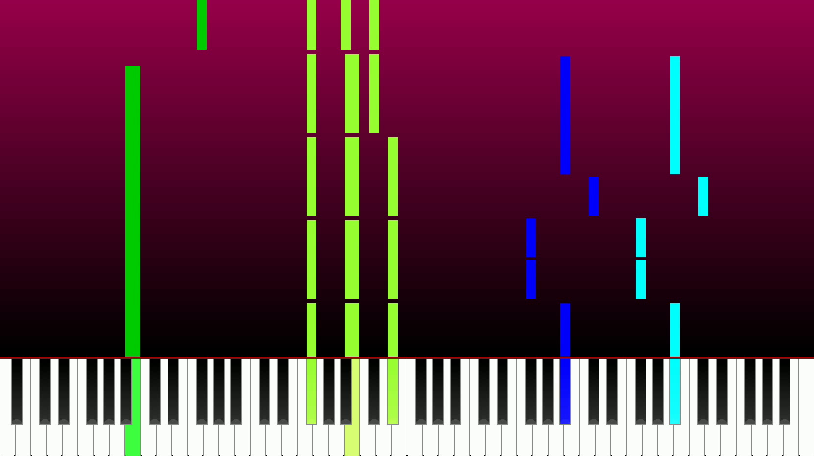

Small script to generate a video to help playing a piano song from a midi file.

_(I only made it (and tried it) on one song, so I guess the script is still full of bugs, and may not be compatible with a lot of midi file formats)_

# Configuration 
1. Create the conda environement: `conda env create -f env_prereqs.yaml`
2. If you don't have it already installed: Download [Musescore AppImage](https://musescore.org/en/download) and save it into this directory.
3. Make it executable: `chmod u+x MuseScore*.AppImage`
4. Install ffmpeg the way you want (on ubuntu based distribution, you can just use the software center to get it)

# Instructions: From the score/midi file to the video with sound
0. [If necessary] Creating the midi file
If you only have the score on Musescore, you can generate the midi file by exporting it with musescore.
`./MuseScore-*.AppImage score.mscz -o music.mid`

1. Convert the midi file to wav audio file using musescore
`./MuseScore-*.AppImage music.mid -o music.wav`

2. Generate the video
`conda activate piano_env`
`python generate_video.py -i music.mid -o music.mp4`
For help, type `python generate_video.py --help`

3. Resize the video using ffmpeg
`ffmpeg -i music.mp4 -s 1920x1080 -c:a copy music_full_hd.mp4`

4. Add the sound to the video using ffmpeg  
`ffmpeg -i music_full_hd.mp4 -itsoffset 3.0 -i music.wav -c:v copy -map 0:v:0 -map 1:a:0 -c:a aac -b:a 192k music_full_hd_with_sound.mp4`  
Important remark 1: The `itoffset` value need to correspond to the value used for generating the video [by default: 3 seconds].  
Important remark 2: The `itoffset` argument may a glitch in the video, if you don't want that, you can first add a silence to the audio and then run this command without the `itoffset` argument.  
Example:  
`ffmpeg -i music.wav -af "adelay=3s:all=true" music_delayed.wav`  
`ffmpeg -i music_full_hd.mp4 -i music_delayed.wav -c:v copy -map 0:v:0 -map 1:a:0 -c:a aac -b:a 192k music_full_hd_with_sound.mp4`  

# Dependencies
Python packages:
- numpy
- mido
- opencv

Other dependencies:
- MuseScore (To generate the audio file to add to the video)
- FFmpeg (To add the audio to the video)

# To do
Of course, there is a lot to do... but the main tasks to do next would be:
- Check that the script is working with *Note Off* midi files (for now I only tested it with a midi file where the end of the note is detected when the message type is *Note On* with a *velocity* of *0*)
- The way I draw the notes is ugly, there must be a better way.